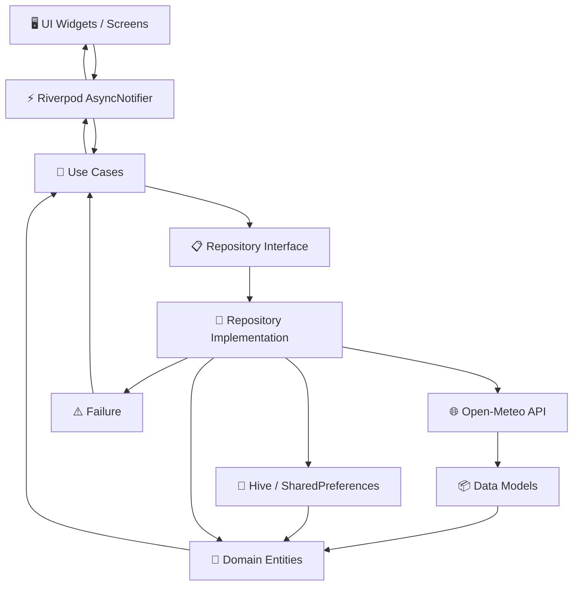

# 🌤️ WeatherWise

<p align="center">
  
  
  
  
  
  
</p>

<p align="center">
  <strong>A modern, fast, and offline-first weather application built with Flutter.</strong>
</p>

<p align="center">
  WeatherWise provides real-time weather conditions, hourly forecasts, daily predictions,
  location search, favorites, local caching, and a clean Material 3 interface.
</p>

<p align="center">
  <a href="#-features">Features</a> •
  <a href="#-architecture">Architecture</a> •
  <a href="#-tech-stack">Tech Stack</a> •
  <a href="#-project-structure">Project Structure</a> •
  <a href="#-getting-started">Getting Started</a> •
  <a href="#-roadmap">Roadmap</a> •
  <a href="#-contact">Contact</a>
</p>

---

## 📱 About

**WeatherWise** is a modern Flutter weather application built with a strong focus on **Clean Architecture**, **functional programming**, **reactive state management**, and **offline-first data handling**.

The application uses **Open-Meteo** for weather and geocoding data and combines remote APIs with local persistence to provide a smooth and reliable experience.

### 🎯 Project Goals

* 🏗️ Maintainable and scalable architecture
* ⚡ Fast and responsive user experience
* 🔄 Reactive state management
* 💾 Offline-first data handling
* 🧩 Clear separation of concerns
* 🛡️ Explicit and predictable error handling
* 🎨 Modern Material 3 interface
* 🧪 Testable and maintainable codebase

---

# ✨ Features

## 🌡️ Weather

* 🌍 Real-time weather conditions
* 🌡️ Current temperature
* 🤒 Feels-like temperature
* 💧 Humidity
* ☀️ UV index
* 💨 Wind speed and direction
* 📊 Surface pressure
* 💦 Dew point
* 🌅 Sunrise and sunset
* 🕐 24-hour forecast
* 📅 7-day forecast
* 📈 Hourly temperature trends

## 📍 Location & Search

* 📡 GPS-based weather detection
* 🗺️ Reverse geocoding
* 🔎 Global city search
* 🕘 Recent search history
* ⭐ Favorite locations
* 🌎 Worldwide location support

## 💾 Local Storage & Offline Support

WeatherWise uses local persistence to provide faster access to frequently used data and support offline scenarios.

* 📦 **Hive Object Storage** — Stores favorites, search history, and cached weather snapshots.
* ⭐ **Persistent Favorites** — Saved locations remain available between app sessions.
* 🕘 **Persistent Search History** — Recent searches are stored locally for quick access.
* ⚙️ **Persistent Preferences** — User preferences such as theme and temperature unit can be persisted.
* 🌐 **Offline Fallback** — Previously cached weather data can be displayed when the network is unavailable.

## 🎨 UI & UX

* 🌓 Light and Dark themes
* 🎨 Material 3 design
* 📱 Responsive layouts
* ✨ Clean weather-focused interface
* 🔄 Reactive loading states
* ⚠️ User-friendly error states
* 🔤 Custom typography using `Inter_24pt`
* 🧩 Reusable UI components

---

# ⚙️ Settings & Preferences

> 🚧 **Planned Feature**

A dedicated **Settings** screen is planned for future versions of WeatherWise.

The planned settings experience will allow users to manage:

* 🌡️ **Temperature Unit** — Celsius (°C) / Fahrenheit (°F)
* 🌓 **Theme** — Light / Dark / System
* 📍 **Location Preferences** — GPS and location behavior
* 💾 **Cache Management** — View or clear cached weather data
* ⭐ **Favorite Locations** — Manage saved locations
* 🕘 **Search History** — Clear or manage recent searches
* 🔄 **Data Preferences** — Configure refresh and offline behavior
* ℹ️ **About** — App version, API information, and project details

The Settings feature will integrate with the existing local persistence architecture where appropriate.

---

# 🏛️ Architecture

WeatherWise follows **Clean Architecture** combined with a **feature-first project structure**.

The application is divided into three primary layers:

```text
┌─────────────────────────────────────────────────────────┐
│                    PRESENTATION                         │
│                                                         │
│      Screens → Widgets → Riverpod Providers             │
└───────────────────────────┬─────────────────────────────┘
                            │
                            ▼
┌─────────────────────────────────────────────────────────┐
│                       DOMAIN                            │
│                                                         │
│      Use Cases → Repository Contracts → Entities        │
└───────────────────────────┬─────────────────────────────┘
                            │
                            ▼
┌─────────────────────────────────────────────────────────┐
│                         DATA                            │
│                                                         │
│ Repository Impl → Remote/Local Data Sources → Models   │
└─────────────────────────────────────────────────────────┘
```

## 🔄 Data Flow



---

# 🧠 Architectural Principles

### 🎯 Clean Architecture

Each layer has a clearly defined responsibility:

| Layer                | Responsibility                                                       |
| -------------------- | -------------------------------------------------------------------- |
| 🖥️ **Presentation** | UI, widgets, screens, and application state                          |
| 🧠 **Domain**        | Business rules, entities, repository contracts, and use cases        |
| 💾 **Data**          | APIs, local storage, models, mapping, and repository implementations |

The Domain layer remains independent from Flutter UI and external data sources.

### 🛡️ Functional Error Handling

WeatherWise uses `fpdart` and `Either<Failure, Success>` to make failures explicit.

```dart
Future<Either<Failure, Weather>> execute();
```

This keeps error handling predictable and reduces reliance on unhandled runtime exceptions.

### ⚡ Reactive State Management

**Riverpod** manages asynchronous application state through providers and `AsyncNotifier`.

```text
Loading
   │
   ├──────────────► Success ───────► Weather Data
   │
   └──────────────► Error
```

### 🔌 Dependency Injection

Dependencies are provided through Riverpod providers, keeping implementations decoupled from business logic and making components easier to test and replace.

---

# 📂 Project Structure

WeatherWise uses a **feature-first architecture** with shared `core` and `common` infrastructure.

```text
lib/
│
├── main.dart
│
├── core/
│   ├── configs/
│   │   ├── constant/
│   │   ├── assets/
│   │   └── theme/
│   │
│   ├── network/
│   │   ├── dio_client.dart
│   │   └── interceptor.dart
│   │
│   └── utils/
│       
│
├── common/
│   ├── theme/
│   │   ├── app_theme.dart
│   │   ├── light_theme.dart
│   │   └── dark_theme.dart
│   │
│   └── widgets/
│       └── reusable_widgets/
│
└── features/
    │
    ├── weather/
    │   ├── data/
    │   │   ├── datasources/
    │   │   │   ├── weather_remote_data_source.dart
    │   │   │   └── weather_local_data_source.dart
    │   │   │
    │   │   ├── models/
    │   │   │   └── weather_model.dart
    │   │   │
    │   │   └── repositories/
    │   │       └── weather_repository_impl.dart
    │   │
    │   ├── domain/
    │   │   ├── entities/
    │   │   │   └── weather.dart
    │   │   │
    │   │   ├── repositories/
    │   │   │   └── weather_repository.dart
    │   │   │
    │   │   └── usecases/
    │   │       ├── fetch_current_weather.dart
    │   │       └── fetch_forecast.dart
    │   │
    │   └── presentation/
    │       ├── providers/
    │       ├── screens/
    │       │   └── weather_dashboard.dart
    │       │
    │       └── widgets/
    │           ├── weather_card.dart
    │           ├── metric_tile.dart
    │           └── forecast_chart.dart
    │
    ├── search/
    │   ├── data/
    │   ├── domain/
    │   └── presentation/
    │
    └── favorites/
        ├── data/
        ├── domain/
        └── presentation/
```

---

# 💾 Local Storage Strategy

WeatherWise uses a hybrid persistence strategy based on **Hive** and **SharedPreferences**.

| Technology               | Purpose                       | Stored Data                                     |
| ------------------------ | ----------------------------- | ----------------------------------------------- |
| 🐝 **Hive**              | Object storage & caching      | Favorites, search history, weather snapshots    |
| ⚙️ **SharedPreferences** | Lightweight key-value storage | Theme, temperature unit, and simple preferences |

## 🔄 Offline-First Flow

```text
                 User Request
                      │
                      ▼
               Check Local Cache
                      │
            ┌─────────┴─────────┐
            │                   │
        Available            Missing
            │                   │
            ▼                   ▼
      Display Cached       Request API Data
         Weather                 │
                                 ▼
                          Save Local Cache
                                 │
                                 ▼
                            Update UI
```

This allows WeatherWise to display previously cached information when the network is unavailable.

---

# 🌐 API & Data Sources

WeatherWise uses **Open-Meteo** for weather and geocoding data.

## 🌤️ Weather API

```text
https://api.open-meteo.com/v1/
```

Used for:

* Current weather
* Hourly forecasts
* Daily forecasts
* Temperature
* Humidity
* Wind
* UV index
* Pressure
* Dew point
* Sunrise and sunset

## 🗺️ Geocoding API

```text
https://geocoding-api.open-meteo.com/v1/
```

Used for:

* Global city search
* Location discovery
* Geographic coordinates

---

# 🛠️ Tech Stack

| Technology               | Purpose                                 |
| ------------------------ | --------------------------------------- |
| 🐦 **Flutter**           | Cross-platform UI framework             |
| 🎯 **Dart**              | Programming language                    |
| ⚡ **Riverpod**           | State management & dependency injection |
| 🌐 **Dio**               | HTTP networking                         |
| 🐝 **Hive**              | Local object storage                    |
| ⚙️ **SharedPreferences** | Lightweight persistence                 |
| 🧩 **fpdart**            | Functional programming & error handling |
| 📍 **Geolocator**        | Device location                         |
| 🗺️ **Geocoding**        | Coordinate-to-address conversion        |
| 🎨 **Material 3**        | UI design system                        |
| 🔤 **Inter**             | Application typography                  |
| 🌤️ **Open-Meteo**       | Weather and geocoding data              |

---

# 📦 Dependencies

```yaml
environment:
  sdk: ^3.13.0

dependencies:
  # 🎨 UI & Icons
  flutter_lucide: ^1.47.0
  cupertino_icons: ^1.0.8
  intl: ^0.20.3

  # ⚡ State Management & DI
  flutter_riverpod: ^3.4.3

  # 🌐 Networking
  dio: ^5.11.1
  pretty_dio_logger: ^1.4.0
  flutter_dotenv: ^6.0.1

  # 📍 Location
  geolocator: ^14.0.2
  geocoding: ^5.0.0

  # 💾 Storage & Functional Programming
  shared_preferences: ^2.5.5
  hive_flutter: ^1.1.0
  fpdart: ^1.1.0
```

---

# 🚀 Getting Started

## 📋 Prerequisites

Make sure you have the following installed:

* 🐦 Flutter SDK `3.13.0+`
* 🎯 Dart SDK
* 💻 Android Studio or VS Code
* 🍎 Xcode for iOS development
* 📱 Android Emulator or iOS Simulator

---

## 1️⃣ Clone the Repository

```bash
git clone https://github.com/your-username/weatherwise.git

cd weatherwise
```

---

## 2️⃣ Configure Environment Variables

Create a `.env` file in the project root:

```env
BASE_URL=https://api.open-meteo.com/v1/
GEOCODING_URL=https://geocoding-api.open-meteo.com/v1/
```

---

## 3️⃣ Install Dependencies

```bash
flutter pub get
```

---

## 4️⃣ Generate Launcher Icons

If launcher icon generation is configured:

```bash
flutter pub run flutter_launcher_icons
```

---

## 5️⃣ Run the Application

```bash
flutter run
```

---

# 🧪 Testing & Code Quality

Run the Flutter test suite:

```bash
flutter test
```

Run static analysis:

```bash
flutter analyze
```

Format the project:

```bash
dart format .
```

---

# 🔐 Permissions

WeatherWise may require location permissions to provide weather conditions for the user's current position.

## Android

Configure location permissions in:

```text
android/app/src/main/AndroidManifest.xml
```

## iOS

Configure the appropriate location usage description in:

```text
ios/Runner/Info.plist
```

---

# 🎨 Design Philosophy

> **Useful weather information should be visible at a glance.**

WeatherWise prioritizes:

* 👀 Clear information hierarchy
* 📱 Responsive layouts
* 🎨 Consistent design language
* 🧭 Simple navigation
* 🔤 Readable typography
* 🌓 Light and dark themes
* 🌤️ Meaningful weather visualization
* ⚡ Fast access to frequently used information
* ♿ User-friendly interaction patterns

---

# 🗺️ Roadmap

## ✅ Implemented

* [x] 🌡️ Current weather
* [x] 🕐 Hourly forecast
* [x] 📅 7-day forecast
* [x] 🔎 Global location search
* [x] 📍 GPS location support
* [x] ⭐ Favorite locations
* [x] 🕘 Search history
* [x] 💾 Local storage
* [x] 🌐 Offline weather fallback
* [x] 🌓 Light / Dark theme foundation
* [x] 🏛️ Clean Architecture
* [x] ⚡ Riverpod state management
* [x] 🛡️ Functional error handling

## 🚧 Planned

* [ ] ⚙️ Dedicated Settings screen
* [ ] 🌡️ Temperature unit selector
* [ ] 🌓 System theme option
* [ ] 💾 Cache management
* [ ] 🧹 Clear search history
* [ ] ⭐ Manage favorite locations
* [ ] 🔄 Configurable refresh behavior
* [ ] 🔔 Weather notifications
* [ ] ⚠️ Weather alerts
* [ ] 🗺️ Interactive weather map
* [ ] 📊 Advanced weather charts
* [ ] 🌍 Additional localization
* [ ] 🧪 Expanded unit and integration tests
* [ ] 🖥️ Desktop / Web optimization

---

# 🤝 Contributing

Contributions, suggestions, bug reports, and improvements are welcome.

### Contribution Workflow

```bash
# Create a feature branch
git checkout -b feature/your-feature

# Format the project
dart format .

# Run static analysis
flutter analyze

# Run tests
flutter test

# Commit your changes
git commit -m "feat: add your feature"

# Push your branch
git push origin feature/your-feature
```

Then open a Pull Request.

---

# 📬 Contact

Have a question, suggestion, bug report, or want to collaborate?

<p align="center">
  <a href="mailto:jawadalsahily622@gmail.com">
    
  </a>
  <a href="https://www.linkedin.com/in/jawad-40434841b/">
    
  </a>
  <a href="https://github.com/jawad64646">
    
  </a>
</p>

<p align="center">
  📧 <strong>Email:</strong> jawadalsahily622@gmail.com
</p>

---

# 📄 License

This project is available under the **MIT License**.

See the `LICENSE` file for more information.

---

<p align="center">
  🌤️ <strong>WeatherWise</strong>
</p>

<p align="center">
  <em>Know the weather. Plan your day.</em>
</p>

<p align="center">
  Built with ❤️ using Flutter & Dart.
</p>
